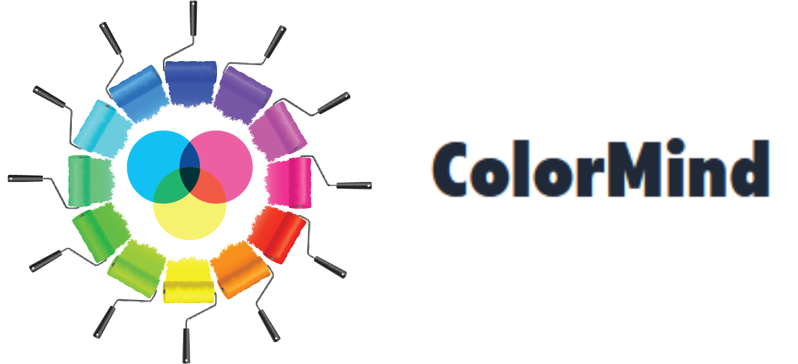

    
  

    <a href="https://v49-tier2-team-12.vercel.app">View App</a>
    &nbsp;·&nbsp;
    <a href="https://github.com/chingu-voyages/v49-tier2-team-12/issues">Report Bug</a>
    &nbsp;·&nbsp;
    <a href="https://github.com/chingu-voyages/v49-tier2-team-12/issues">Request Feature</a>
  

## Table of Contents
- [Project Description](#project-description)
- [Built With](#built-with)
- [Tools Used](#tools-used)
- [Features](#features)
- [Getting Started (on web)](#getting-started-on-web)
- [Getting Started (locally)](#getting-started-locally)
- [Our Team](#our-team)

## Project Description
ColorMind is a web application that helps users receive color recommendations based on a context. Users pick a color and write the context, explaining how they want to use it. They get an AI response with compatible colors and recommendations. They can also simulate how the selected color might look like for people with vision deficiencies. 

## Built With

 &nbsp;&nbsp; &nbsp;&nbsp; &nbsp;&nbsp; &nbsp;&nbsp; &nbsp;&nbsp;

## Tools Used

  
 &nbsp;&nbsp; &nbsp;&nbsp; &nbsp;&nbsp; &nbsp;&nbsp;

  
 &nbsp;&nbsp; &nbsp;&nbsp; &nbsp;&nbsp; &nbsp;&nbsp;

## Features
- **Color selection:** Users are able to select a color from the wheel or add their own color hexadecimal code
- **Context interpretation:** Users are able to provide a context for using that color and the AI will adapt the response based on it
- **Color recommendations:** The AI will give recommendations and compatible colors, presenting their characteristics
- **Vision deficiencies simulation:** Users are able to simulate how color choices might appear to people with different types of color vision deficiencies

## Getting Started (on web)
Open our app on [Vercel](https://v49-tier2-team-12.vercel.app/)  

## Getting Started (locally)
Clone the repository to your local machine.  
Run <i>npm install</i> in the terminal for the necessary dependencies.  
Install <i>@jaames/iro</i> for the color picker, <i>openai</i> for AI connectivity.  
Create a local .env file at the root level of the project and add the API key you receive from OpenAI (you have to create an account first):
OPENAI_API_KEY from [OpenAI](https://platform.openai.com/playground)  
Run <i>npm run dev</i> in the terminal.  
Check the app at the indicated local link (ex: http://localhost:3000).

## Our Team
### Developers:
- Parykhan jameel: [GitHub](https://github.com/parykhan-jameel) / [LinkedIn](https://linkedin.com/in/parykhan-jameel)
- Andrei Olteanu: [GitHub](https://github.com/andreiolteanu555) / [LinkedIn](https://www.linkedin.com/in/andrei-olteanu-9009/)
- Riry Nomenjanahary: [GitHub](https://github.com/TiaDev7474) / [LinkedIn](https://www.linkedin.com/in/riry-nomenjanahary-a47a85264)
- Zarrar Hussain Abid: [GitHub](https://github.com/Zarrarabid) / [LinkedIn](https://www.linkedin.com/in/zarrar-abid-a1667121a/)
